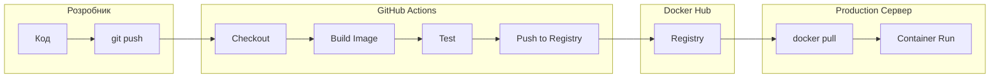
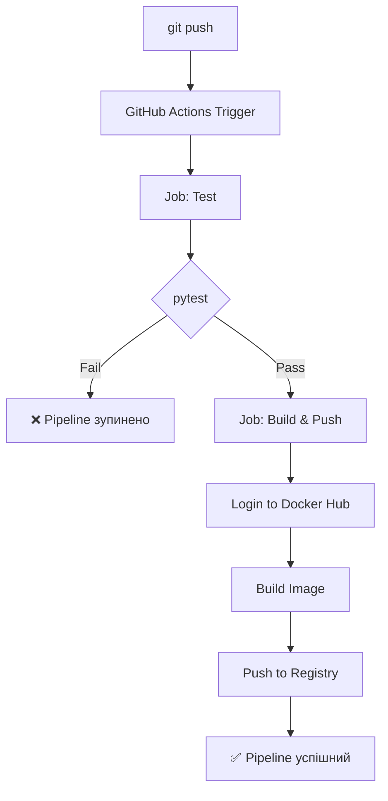

# Комплексне практичне завдання

## Тема: CI/CD пайплайн для Docker-додатку з автоматичним розгортанням

---



---

## Мета роботи

Навчитись:

- створювати контейнеризований Python Web API
- автоматизувати збірку та тестування
- реалізовувати CI/CD пайплайн через GitHub Actions
- публікувати Docker-образи у Docker Hub
- виконувати автоматичне розгортання контейнерів

---

## Сценарій

Ви DevOps-інженер. Потрібно створити CI/CD пайплайн для Python Flask додатку з автоматичною збіркою, тестуванням, публікацією образу та розгортанням.

---

## Час виконання

≈ 30 хвилин

---

## Структура проєкту

```
devops-cicd-demo/
│
├── app.py                 # Flask Web API
├── requirements.txt       # Залежності
├── Dockerfile             # Інструкція для збірки образу
├── docker-compose.yml     # Локальна оркестрація
├── .github/
│   └── workflows/
│       └── ci-cd.yml      # GitHub Actions пайплайн
└── tests/
    └── test_app.py        # Автотести
```

---

## Частина 1. Створення Web API (5 хв)

### Крок 1. Створіть папку проєкту та файли

```bash
mkdir devops-cicd-demo && cd devops-cicd-demo
```

#### `app.py`

```python
from flask import Flask, jsonify
import os

app = Flask(__name__)

@app.route("/")
def home():
    return {"message": "DevOps CI/CD Pipeline працює!", "version": os.getenv("APP_VERSION", "1.0")}

@app.route("/health")
def health():
    return jsonify({"status": "OK", "service": "web-api"})

if __name__ == "__main__":
    app.run(host="0.0.0.0", port=5000)
```

#### `requirements.txt`

```text
flask==2.3.3
pytest==7.4.0
```

---

## Частина 2. Створення безпечного Dockerfile (3 хв)

### Крок 2. Додайте `Dockerfile`

```dockerfile
FROM python:3.11-slim AS builder

WORKDIR /app
COPY requirements.txt .
RUN pip install --no-cache-dir -r requirements.txt

FROM python:3.11-slim

# Безпека: створюємо non-root користувача
RUN addgroup --system --gid 1001 appgroup && \
    adduser --system --uid 1001 --gid 1001 appuser

WORKDIR /app

# Копіюємо тільки необхідні файли
COPY --from=builder /usr/local/lib/python3.11/site-packages /usr/local/lib/python3.11/site-packages
COPY --from=builder /usr/local/bin /usr/local/bin
COPY app.py .

USER appuser

EXPOSE 5000

HEALTHCHECK --interval=30s --timeout=3s --start-period=5s --retries=3 \
  CMD curl -f http://localhost:5000/health || exit 1

CMD ["python", "app.py"]
```

> ✅ **Переваги:**
>
> - Non-root user (appuser) — зменшує ризики
> - Multi-stage build — менший розмір образу
> - HEALTHCHECK — автоматичний моніторинг стану

---

## Частина 3. Тестування (3 хв)

### Крок 3. Створіть `tests/test_app.py`

```python
import pytest
from app import app

@pytest.fixture
def client():
    app.config['TESTING'] = True
    with app.test_client() as client:
        yield client

def test_home(client):
    response = client.get('/')
    assert response.status_code == 200
    assert b"DevOps CI/CD Pipeline" in response.data

def test_health(client):
    response = client.get('/health')
    assert response.status_code == 200
    assert response.json["status"] == "OK"
```

### Крок 4. Локальний запуск тестів

```bash
pip install -r requirements.txt
pytest tests/ -v
```

---

## Частина 4. Docker Compose (2 хв)

### Крок 5. `docker-compose.yml`

```yaml
version: '3.9'

services:
  web:
    build: .
    container_name: devops-web
    ports:
      - "5000:5000"
    restart: unless-stopped
    environment:
      - APP_VERSION=1.0
    healthcheck:
      test: ["CMD", "curl", "-f", "http://localhost:5000/health"]
      interval: 30s
      timeout: 5s
      retries: 3
```

### Крок 6. Локальний запуск

```bash
docker compose up -d
curl http://localhost:5000
```

**Очікуваний результат:**

```json
{"message":"DevOps CI/CD Pipeline працює!","version":"1.0"}
```

---

## Частина 5. Налаштування GitHub (3 хв)

### Крок 7. Ініціалізація Git

```bash
git init
git add .
git commit -m "Initial commit: Flask API with Docker"
```

### Крок 8. Створіть репозиторій на GitHub

```bash
git remote add origin https://github.com/YOUR_USERNAME/devops-cicd-demo.git
git branch -M main
git push -u origin main
```

### Крок 9. Створіть Docker Hub репозиторій

```
YOUR_USERNAME/devops-demo
```

### Крок 10. Додайте Secrets у GitHub

**Settings → Secrets and variables → Actions → New repository secret**

| Secret Name         | Value                                        |
| ------------------- | -------------------------------------------- |
| `DOCKER_USERNAME` | Ваш Docker Hub логін                 |
| `DOCKER_TOKEN`    | Docker Hub Access Token (не пароль!) |

> ⚠️ **Безпека:** Використовуйте Access Token замість пароля!

---

## Частина 6. CI/CD Pipeline GitHub Actions (5 хв)

### Крок 11. Створіть `.github/workflows/ci-cd.yml`

```yaml
name: Docker CI/CD Pipeline

on:
  push:
    branches: [ main ]
  pull_request:
    branches: [ main ]

env:
  REGISTRY: docker.io
  IMAGE_NAME: ${{ secrets.DOCKER_USERNAME }}/devops-demo

jobs:
  # 1. ТЕСТУВАННЯ
  test:
    runs-on: ubuntu-latest
    steps:
      - name: Checkout code
        uses: actions/checkout@v4

      - name: Set up Python
        uses: actions/setup-python@v5
        with:
          python-version: '3.11'

      - name: Install dependencies
        run: |
          pip install -r requirements.txt

      - name: Run tests
        run: pytest tests/ -v

  # 2. ЗБІРКА ТА ПУБЛІКАЦІЯ
  build-and-push:
    needs: test
    runs-on: ubuntu-latest
    if: github.event_name == 'push'

    steps:
      - name: Checkout code
        uses: actions/checkout@v4

      - name: Set up Docker Buildx
        uses: docker/setup-buildx-action@v3

      - name: Log in to Docker Hub
        uses: docker/login-action@v3
        with:
          username: ${{ secrets.DOCKER_USERNAME }}
          password: ${{ secrets.DOCKER_TOKEN }}

      - name: Build and push
        uses: docker/build-push-action@v5
        with:
          context: .
          push: true
          tags: |
            ${{ env.IMAGE_NAME }}:latest
            ${{ env.IMAGE_NAME }}:${{ github.sha }}
          cache-from: type=gha
          cache-to: type=gha,mode=max
```



---

## Частина 7. Розгортання на сервері (3 хв)

### Крок 12. На сервері (production)

```bash
# Завантаження останнього образу
docker pull YOUR_USERNAME/devops-demo:latest

# Зупинка старого контейнера (якщо є)
docker stop devops-web 2>/dev/null || true
docker rm devops-web 2>/dev/null || true

# Запуск нової версії
docker run -d \
  --name devops-web \
  -p 5000:5000 \
  --restart unless-stopped \
  YOUR_USERNAME/devops-demo:latest
```

---

## Частина 8. Перевірка автоматичного оновлення (3 хв)

### Крок 13. Внесіть зміну в код

```python
# app.py - змініть рядок home()
return {"message": "Нова версія CI/CD Pipeline!", "version": "2.0"}
```

### Крок 14. Push змін

```bash
git add .
git commit -m "Update to version 2.0"
git push
```

### Крок 15. Спостерігайте

1. GitHub Actions автоматично запускає пайплайн
2. Новий образ з'являється в Docker Hub з тегом `latest`
3. На сервері виконайте оновлення:

```bash
docker pull YOUR_USERNAME/devops-demo:latest
docker stop devops-web && docker rm devops-web
docker run -d --name devops-web -p 5000:5000 YOUR_USERNAME/devops-demo:latest

curl http://localhost:5000
# {"message":"Нова версія CI/CD Pipeline!","version":"2.0"}
```

---

## Частина 9. Вдосконалення (опціонально)

### Додавання автоматичного деплою (Webhook)

```yaml
# Додайте в кінець ci-cd.yml
- name: Trigger webhook for deployment
  run: |
    curl -X POST https://your-server.com/deploy \
      -H "Content-Type: application/json" \
      -d '{"image":"${{ env.IMAGE_NAME }}:${{ github.sha }}"}'
```

### Додавання тегу версії

```yaml
- name: Get version from git tag
  run: echo "VERSION=${GITHUB_REF#refs/tags/}" >> $GITHUB_ENV

- name: Build with version tag
  uses: docker/build-push-action@v5
  with:
    tags: |
      ${{ env.IMAGE_NAME }}:${{ env.VERSION }}
      ${{ env.IMAGE_NAME }}:latest
```

---

## Контрольні питання

| # | Питання                                                                                              |
| - | ----------------------------------------------------------------------------------------------------------- |
| 1 | Як GitHub Actions автоматично запускається при push?                            |
| 2 | Навіщо використовувати `needs: test` в пайплайні?                          |
| 3 | Що робить `docker/build-push-action`?                                                             |
| 4 | Які переваги non-root user в Dockerfile?                                                        |
| 5 | Як забезпечити, щоб контейнер автоматично перезапускався? |

---

## Типові помилки та рішення

| Помилка                  | Рішення                                                                 |
| ------------------------------- | ------------------------------------------------------------------------------ |
| `login failed`                | Перевірте DOCKER_USERNAME та DOCKER_TOKEN                           |
| `ModuleNotFoundError: flask`  | Перевірте requirements.txt                                            |
| `curl: (7) Failed to connect` | Перевірте порт 5000 та HEALTHCHECK                              |
| `permission denied`           | Переконайтесь, що використовується USER appuser |

---

## Фінальний чекліст

- [ ] Flask API працює локально (`curl http://localhost:5000`)
- [ ] Docker образ будується (`docker build -t test .`)
- [ ] Тести проходять (`pytest tests/ -v`)
- [ ] GitHub Actions пайплайн зелений
- [ ] Образ з'явився в Docker Hub
- [ ] Контейнер на сервері показує актуальну версію

---
